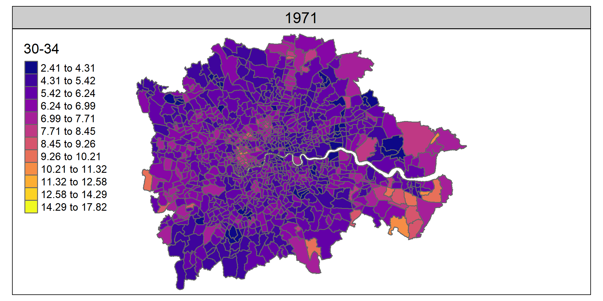
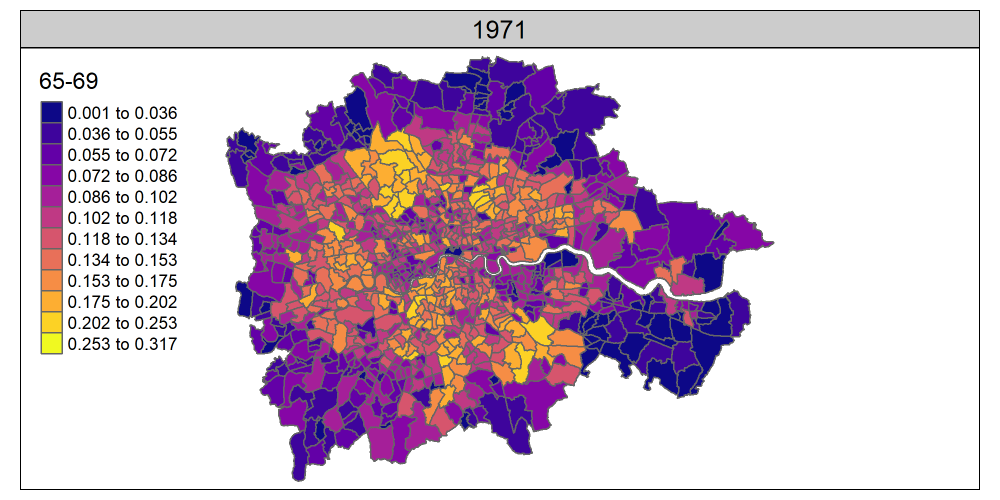
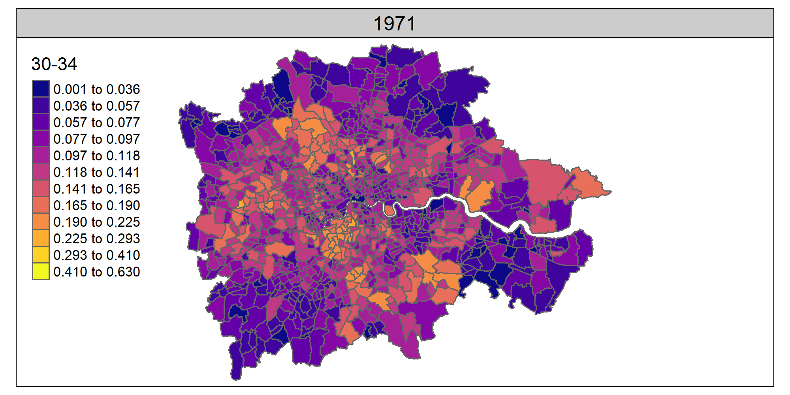
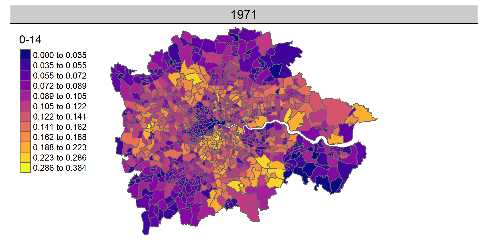

# UK 5-Census (1971-2011) age bands at 1991 ward level: examples of change in London

## Per zone proportion change

These first two show **per-zone proportion** change in two age-bands: 30-34 year olds and 65-69 year olds. They show the opposite pattern: more older people on the outskirts, younger more centralised. (Note: this is only based on counts per zone, so can't say how those changes break down into migratory (both short-distance local migration, internal or international) / people in place ageing etc).

## 30-34 year olds: per zone proportions 71-11

## 65-69 year olds: per zone proportions 71-11

## Across-London proportion change

Different way of looking at the same thing. These two use the **proportion of each age-group across all London wards** - e.g. the proportion of 30-34 year olds in London sum to 100% across all wards in the first plot below. They show for a given decade what the spread of that age group is across London.

## 30-34 year olds: across-London proportions 71-11

## 65-69 year olds: across-London proportions 71-11

## Contrast to across-London proportion for children (0-14 year olds) - it's changed, but not all that radically:

