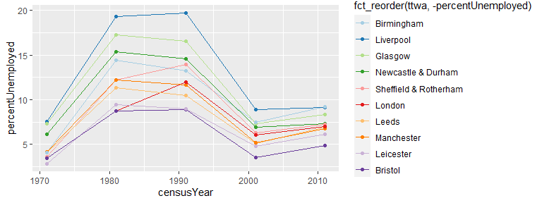
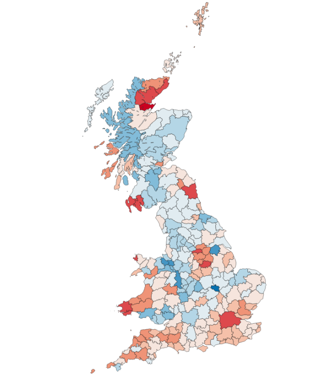
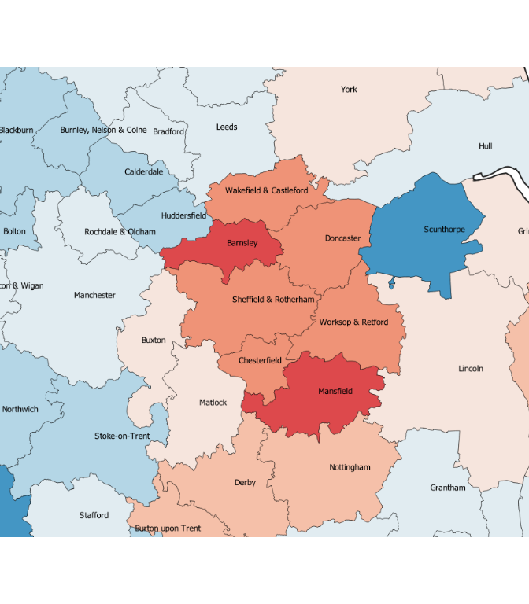

**These plots or just for thinking, not for publishing.**

Some pre-amble bullet points:

* The data is **percent unemployed in 1991 (tweaked) wards** across 5 Censuses from 1971 to 2011. Percent unemployed is a subset of the count of **economically active people**.
* So an issue we face here: there were many people pushed onto long-term disability benefits, especially in ex-mining communities, who I think will have been in the stats as 'economically inactive' (see e.g. this by a couple of UoS economists: [New Evidence on Disability Benefit Claims in
the UK: The Role of Health and Local Labour
Market, Roberts & Taylor 2019](https://www.sheffield.ac.uk/media/7133/download).) Wonder if it's possible to get data on that? (They use BHS here.)

# Starting with just looking at unemployment change within the Sheffield/Rotherham TTWA itself...

<!-- -->

# Sheffield in context: top ten TTWAs (by economically active population): change in unemployment over the 5 Censuses

Note Sheffield and London between 1981 and 1991: unemployment rising where most drop.

<!-- -->

Sheffield and London were 2 of 50% of TTWAs that saw unemployment rise from 81-91. The pattern between Censuses is:

* 71-81: every single TTWA saw unemployment **rise**
* 81-91: 51% saw unemployment rise, the other half dropped (see maps below, there's a pattern that's relevant.)
* 91-01: every single TTWA saw unemployment **drop**
* 01-11: 77% saw unemployment rise.

# Geography of unemployment change 1981-1991

So, unemployment rose everywhere from 71-81. For that 50% split from 81 to 91, there's a geography to it. No legend here, but gives the impression: 

* Redder = unemployment rising more
* Bluer = unemployment dropping more

<!-- -->

That cluster near Sheffield/Rotherham where unemployment went up:

<!-- -->

# Comparing change within each Census (animated GIF)

I wanted to see what Sheffield's unemployment looked like at each Census **compared to the rest of Great Britain at the same time point** (i.e. was it extreme / any outliers etc). To do this I've:

* Used a Z-score of unemployment per ward for each Census (values of zero are the GB mean - standardised scores below zero are relatively **lower** unemployment, above zero are relatively **higher** unemployment, compared to the rest of GB at that Census)
* Compared the top ten TTWAs again
* Animated each Census on the same scale

Things to note:

* Sheffield wards don't appear extreme generally... (compare to Liverpool and Glasgow, for example)
* But note: Sheffield unemployment extends right through the first three Censuses, where many others see a reduction. This supports what the maps are showing - the Sheffield region seemed to have a longer-term unemployment impact (along with other clusters) compared to much of GB.

<!-- -->

